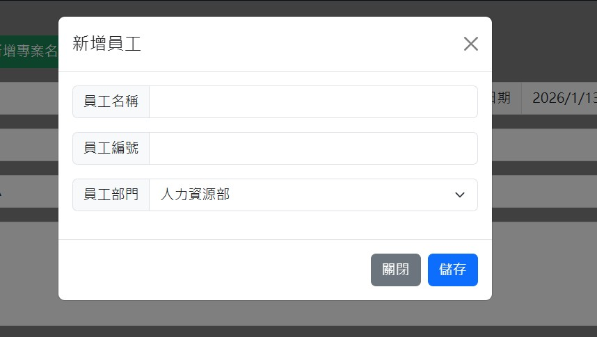
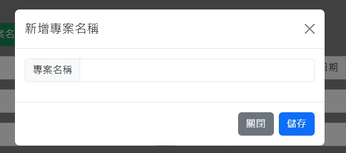
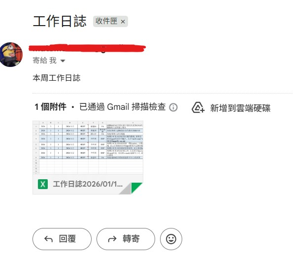

# 工作日誌應用程式 前端程式碼
[工作日誌應用程式 後端程式碼](https://github.com/mute-coding/WorkDiary-Backend)
## 使用工具
- html
- css
- javascript
- bootstrap
- fetch api
## 專案發想
在目前現在這公司，每一周會需要寫一周的工作日誌，是使用EXCEL寫，有時候上班時間沒有時間寫，會利用下班時間寫，但是這樣會有檔案轉移問題，在EXCEL寫也有一些不方便的地方，比如欄位較小等，所以製作一個應用程式，可以在網頁上編輯完工作項目後，可以轉出EXCEL，並且寄送至我的Gmail

## 網頁UI以及功能介紹
#### 輸入資料區域

- "年份"、"第幾周"、"月份"是抓"日期"欄位的值做計算
- "發起人"使用api串接後端的全部員工名稱，利用html的"datalist"標籤，可以用模糊查詢
- "發起單位"串接api後端的員工部門，員工名稱為參數，選擇員工名稱後，自動帶出對應的部門
- "項目名稱"、"專案名稱"串接api，用下拉式選單顯示資料
- "新增員工"以及"新增專案名稱按鈕"可以叫出功能視窗
- 按下"輸入"按鈕，會將該筆資料存進資料表，並且在下方的表格內顯示該筆資料
#### 新增員工視窗

- "員工部門"串接api顯示所有部門資料
- 按下"儲存"，可以新增員工資料至資料庫
#### 新增專案名視窗

- 按下"儲存"，可以新增員工資料至資料庫
#### 工作總分鐘顯示區域

- 用js程式碼，抓取每個表格的最後三個分鐘數欄位，計算那一天的總分鐘為多少
#### 功能按鈕顯示區域

- "下載EXCEL"按鈕為下載目前工作項目，會在後端先轉成EXCEL，在由前端下載下來
- "發送mail"按鈕為將EXCEL發送至我的mail
- "全部刪除"按鈕為刪除資料表的資料

#### 表格區域


- "修改"按鈕 將該筆資料顯示在上方表單上，修改過後，按下"輸入"按鈕，會調用後端patch api，更新資料，並且在表格內同步更新
- "刪除"按鈕 調用後端api，參數為該筆工作項目的id，將該筆資料刪除
## 部屬專案
利用github page部屬前端頁面，後端使用"ngrok"的反向代理，將本機端的ip讓外部網路訪問，因為使用免費版，所以需要在個前端api的hearder加上
``` javascript
 headers:{
      'ngrok-skip-browser-warning': 'true'
    }
```
