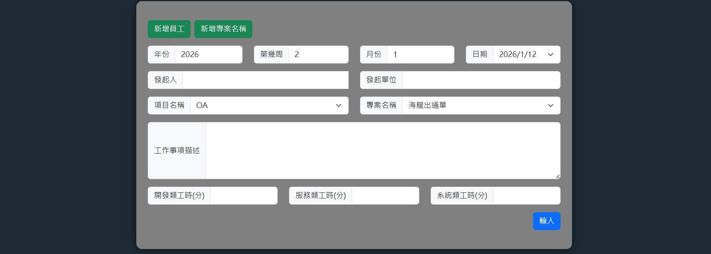
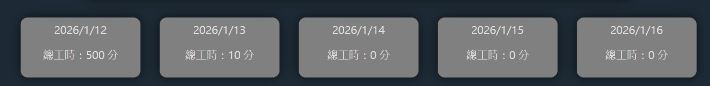
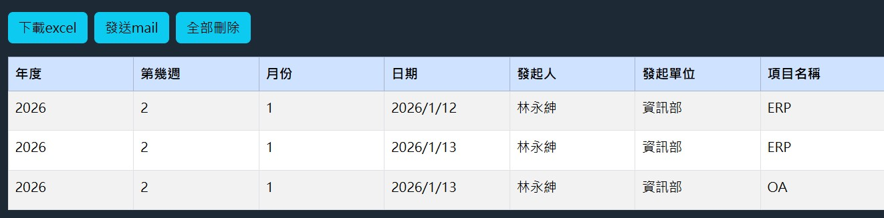
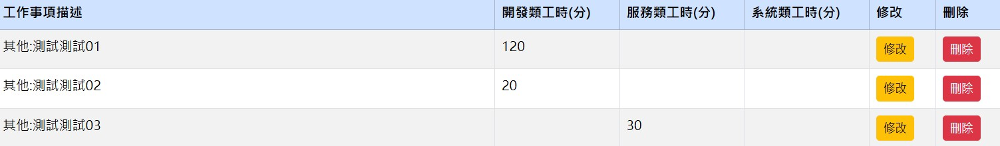

# 工作日誌應用程式 前端程式碼
[工作日誌應用程式 後端程式碼](https://github.com/mute-coding/WorkDiary-Backend)
## 使用工具
- html
- css
- javascript
- bootstrap
- fetch api
## 專案發想
在目前現在這公司，每一周會需要寫一周的工作日誌，是使用EXCEL寫，有時候上班時間沒有時間寫，會利用下班時間寫，但是這樣會有檔案轉移問題，在EXCEL寫也有一些不方便的地方，比如欄位較小等，所以製作一個應用程式，可以在網頁上編輯完工作項目後，可以轉出EXCEL，並且寄送至我的Gmail

## 網頁UI
- 輸入資料區域

- 工作總分鐘顯示區域

- 功能按鈕顯示區域

- 表格區域

